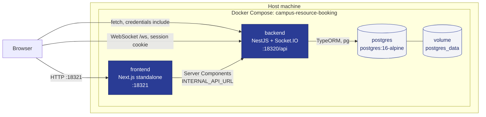
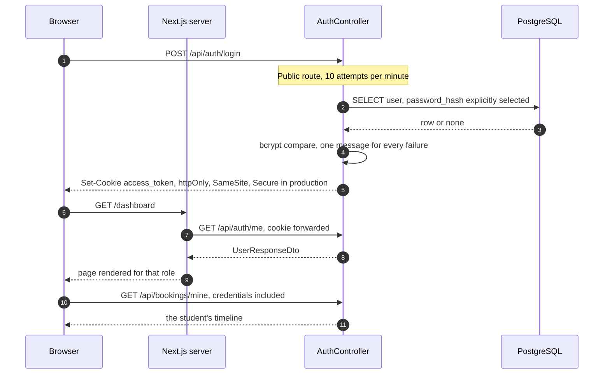
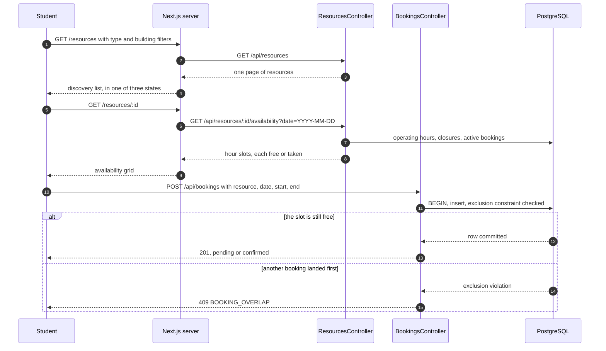
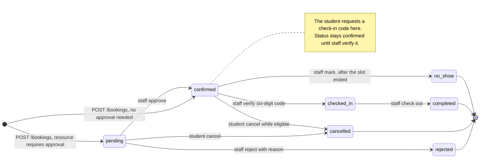
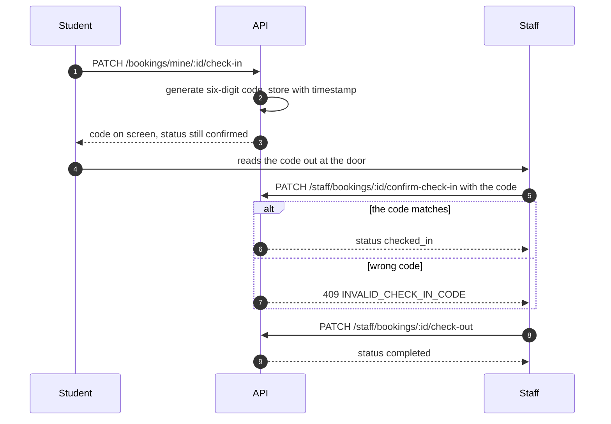
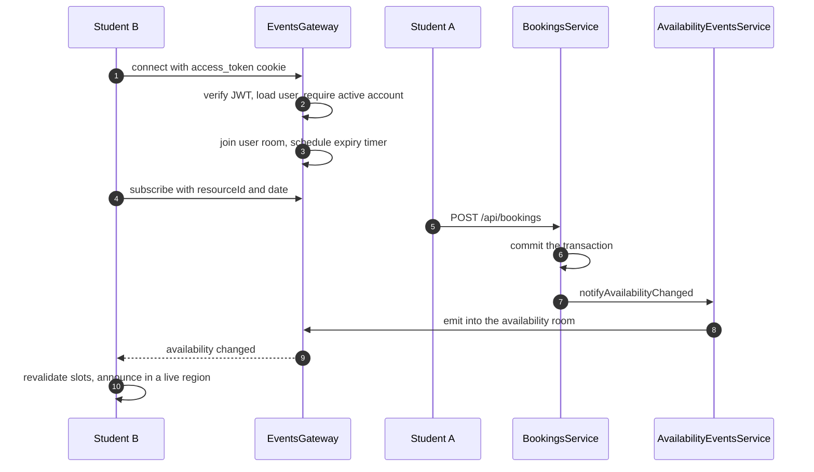
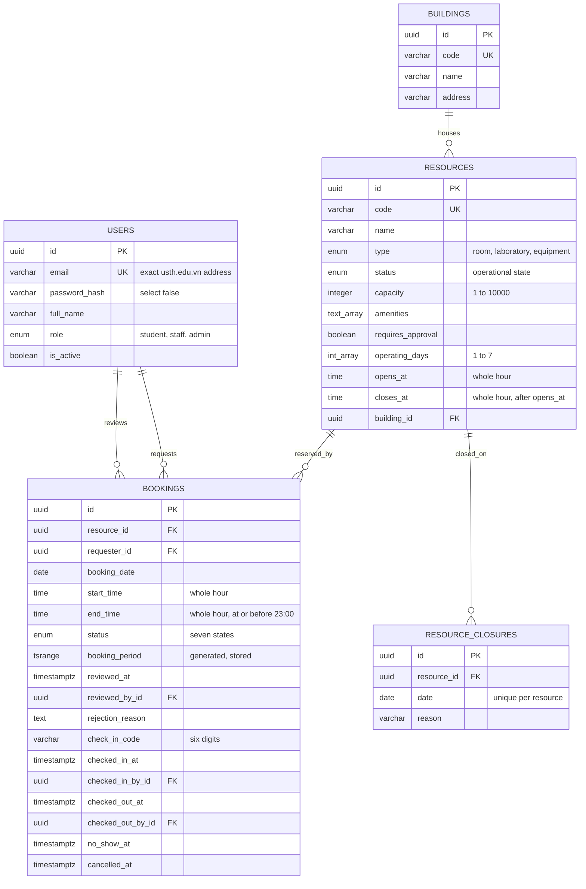
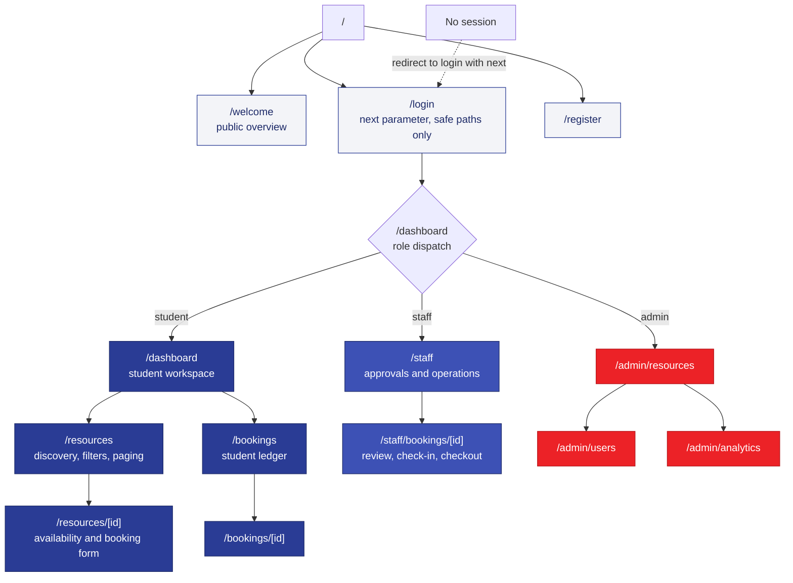

# Campus Resource Booking — Architecture

How the application actually works, told as the flows a real user walks through.
Each of the first sections is one flow: a picture, then the rules the server
applies during it. Structure, data, and reference tables come afterwards,
because they only make sense once you have seen what they serve.

For the course brief, the grading checklist, and the presentation script, see
[`COURSE_PROJECT.md`](./COURSE_PROJECT.md). Product scope is in the
[proposal](./Campus_Resource_Booking_Project_Proposal_EN.docx); contributor
rules are in [`../AGENTS.md`](../AGENTS.md).

**What it is.** A USTH web application for booking rooms, laboratories, and
equipment. Students search and reserve; staff approve requests and run check-in
and check-out; admins manage accounts, resources, and analytics.

| Part     | Technology                                                    |
| -------- | ------------------------------------------------------------- |
| Frontend | Next.js 16, React 19, App Router —`http://localhost:18321` |
| Backend  | NestJS 11, TypeORM —`http://localhost:18320/api`           |
| Database | PostgreSQL 16                                                 |
| Realtime | Socket.IO, namespace`/ws`                                   |

---

## 1. The whole system in one picture

One `compose.yaml` builds and runs all three services from a single multi-stage
`Dockerfile`. Startup is ordered by health checks, not timers: PostgreSQL must
answer a real query before the backend starts, and the backend must pass
`/api/health` before the frontend starts.



Two boundary details explain most of the confusion when reading the code:

- **There are two API base URLs.** Browser code uses `NEXT_PUBLIC_API_URL`,
  baked in at `next build` time. Server Components use `INTERNAL_API_URL`
  (`http://backend:18320/api`) to stay on the Compose network.
- **Migrations run at container start.** The backend command runs
  `typeorm migration:run` and only then `node dist/main`, so the schema is
  current before any traffic is accepted.

---

## 2. Flow 1 — Signing in

Normalized USTH email → verified credentials → `httpOnly` cookie → credentialed
requests. The token never appears in a response body and is never readable from
JavaScript.



- Registration creates **students only**. The first admin and staff accounts come
  from `BOOTSTRAP_*` variables and are provisioned at backend startup by
  `AccountBootstrapService`. Existing accounts are never modified — with one
  deliberate exception: the named admin is restored if no active admin remains.
- Only exact `@usth.edu.vn` addresses pass the auth DTOs.
- `password_hash` is `select: false`; it is read only to verify a password.
- A wrong password and an unknown email return the same status and the same body.
- Redirects after login pass through `getSafeRedirect`, which rejects
  protocol-relative, external, backslash, and control-character paths.

---

## 3. Flow 2 — Finding a resource and booking it

The decisive rule: **whether a booking needs approval is a property of the
resource, not of the person**. A bookable room auto-confirms; a teaching
laboratory (`requires_approval = true`) enters the staff queue.



What the server refuses, and with which code:

| Code                                                                                  | HTTP | Meaning                                                          |
| ------------------------------------------------------------------------------------- | ---- | ---------------------------------------------------------------- |
| `INVALID_BOOKING_DATE`, `INVALID_BOOKING_RANGE`, `BOOKING_IN_PAST`              | 400  | Slot malformed or already past                                   |
| `RESOURCE_NOT_FOUND`, `BOOKING_NOT_FOUND`                                         | 404  | Unknown target, or not yours                                     |
| `RESOURCE_UNAVAILABLE`                                                              | 409  | Closed day, outside operating hours, or resource not operational |
| `BOOKING_OVERLAP`                                                                   | 409  | Another active booking covers the slot                           |
| `BOOKING_NOT_PENDING`, `BOOKING_REVIEW_WINDOW_ENDED`                              | 409  | No longer reviewable                                             |
| `BOOKING_NOT_CANCELLABLE`                                                           | 409  | Outside the cancellation window                                  |
| `CHECK_IN_NOT_AVAILABLE`, `CHECK_IN_ALREADY_REQUESTED`, `INVALID_CHECK_IN_CODE` | 409  | Check-in preconditions unmet                                     |
| `BOOKING_NOT_CHECKED_IN`, `NO_SHOW_NOT_AVAILABLE`                                 | 409  | Checkout or no-show preconditions unmet                          |

Each is a typed `BookingDomainError` raised in `bookings.service.ts` and mapped
to a status in the controller — one place per code, rather than a scatter of
`throw new BadRequestException` across the codebase.

---

## 4. Flow 3 — Approval, and the whole lifecycle

Staff open the pending queue, read the request, and approve or reject it with a
reason. Everything a booking can ever do is in this one picture.



Every write takes a row lock and re-reads the status inside the transaction, so
two staff members clicking *Approve* on the same request cannot both succeed —
the second one gets `BOOKING_NOT_PENDING`. Each actor column is a separate
foreign key to `users`, so the row records *who* approved, checked in, checked
out, or flagged a no-show, and when.

---

## 5. Flow 4 — Check-in and check-out

Check-in is deliberately two-sided: neither party can complete it alone.



If the slot ends and nobody ever checked in, staff mark it `no_show` — which is
why that transition is only legal *after* the end time.

---

## 6. Flow 5 — Availability updating live

A second browser sees a slot disappear without pressing refresh. The WebSocket
handshake is authenticated from the same session cookie as REST.



| Concern            | Implementation                                                                           |
| ------------------ | ---------------------------------------------------------------------------------------- |
| Rooms              | `user:<id>`, `availability:<resourceId>:<date>`, `dashboard:availability:<date>`   |
| Events out         | `availability:changed`, `resource:changed`                                           |
| Limits             | 20 availability rooms and 20 dashboard rooms per socket                                  |
| Payload validation | `resourceId` a UUID, `date` a real `YYYY-MM-DD` — the same rules as the REST DTOs |
| CORS               | `ConfigIoAdapter`, from the same validated origin allowlist as HTTP                    |
| Token expiry       | A per-socket timer disconnects at`exp`                                                 |
| Deactivation       | `UserAccessEvents.deactivated$` drops every socket in that user's room                 |

Emitted by every booking write (create, approve, reject, confirm check-in, check
out, no-show, cancel) and every resource change (edit, status, closure). Pushes
reach assistive technology through `dashboard-live-region` and
`availability-live-region`, so availability never moves silently.

---

## 7. The five flows as one journey

The same story end to end: an admin defines what exists, a student asks for a
slot, PostgreSQL decides whether the slot is free, the resource's own approval
rule decides who has to say yes, attendance decides how it finishes, and every
one of those writes pushes back into the availability every other browser is
looking at.

```mermaid
flowchart LR
    subgraph setup["Admin sets the stage"]
        adm["Buildings, resources,<br/>opening hours,<br/>approval rule, closures"]
    end

    subgraph ask["Student asks"]
        find["Find a resource<br/>filters, availability grid"]
        submit["Submit a booking"]
        free{"Slot still free?<br/>decided by PostgreSQL"}
        clash["409 BOOKING_OVERLAP"]
        needs{"Resource requires<br/>approval?"}
    end

    subgraph decide["Staff decides"]
        pending["pending"]
        queue["Approval queue"]
        review{"Review"}
    end

    subgraph attend["The slot arrives"]
        confirmed["confirmed"]
        arrive{"Student turns up?"}
        verify["Six-digit code,<br/>verified by staff"]
        checkedin["checked_in"]
        out["Staff checks out"]
    end

    subgraph done["It ends one of four ways"]
        rejected(["rejected"])
        cancelled(["cancelled"])
        noshow(["no_show"])
        completed(["completed"])
    end

    signin["Sign in<br/>httpOnly cookie"] --> find
    adm -.->|"defines what can be booked"| find

    find --> submit --> free
    free -->|no| clash --> find
    free -->|yes| needs
    needs -->|"yes, a laboratory"| pending --> queue --> review
    needs -->|"no, a room"| confirmed
    review -->|approve| confirmed
    review -->|"reject with a reason"| rejected

    confirmed --> arrive
    arrive -->|"cancels first"| cancelled
    arrive -->|"no, slot ends"| noshow
    arrive -->|yes| verify --> checkedin --> out --> completed

    pending -.-> push
    confirmed -.-> push
    checkedin -.-> push
    push(["availability changed,<br/>pushed over Socket.IO"]) -.-> find

    done --> ana["Admin analytics:<br/>utilization, status mix, no-show rate"]

    classDef act fill:#2A3C95,stroke:#1d2a68,color:#fff
    classDef st fill:#f3f4f8,stroke:#2A3C95,color:#1d2a68
    classDef fin fill:#EC2227,stroke:#b5171b,color:#fff
    classDef live fill:#3d51b5,stroke:#1d2a68,color:#fff
    class signin,adm,find,submit,queue,verify,out,ana act
    class pending,confirmed,checkedin st
    class rejected,cancelled,noshow,completed fin
    class push,clash live
    classDef phase fill:#f7f8fc,stroke:#c9cfe8,color:#1d2a68
    class setup,ask,decide,attend,done phase
```



Reading it against the rest of this document: signing in is §2, *Find a
resource* through to `pending` or `confirmed` is §3, the staff panel is §4, the
code and the checkout are §5, and the dotted arrows back to *Find* are §6.

Dark boxes are actions, and each one is an HTTP call that went through the
pipeline in the next section. Pale boxes are the `status` value on a row in
`bookings`. Red boxes are the four states a booking can never leave. Analytics
reads every status, in flight or finished, not just the terminal ones.

---
## 8. What every request passes through

The same pipeline runs for all of the flows above, in this order. It is
registered globally in `app.module.ts`, so it cannot be forgotten on a new
route.

```mermaid
flowchart LR
    req["Request"] --> helmet["helmet<br/>security headers"]
    helmet --> ck["cookie-parser"]
    ck --> cors["CORS<br/>explicit origins, credentials"]
    cors --> thr["ThrottlerGuard<br/>global, or 10/min on auth"]
    thr --> jwt["JwtAuthGuard<br/>global unless Public"]
    jwt --> roles["RolesGuard<br/>Roles decorator"]
    roles --> vp["ValidationPipe<br/>whitelist, transform"]
    vp --> ctl["Controller, Service, TypeORM"]
    ctl --> dto["Response DTO<br/>never a raw entity"]

    classDef g fill:#EC2227,stroke:#b5171b,color:#fff
    class thr,jwt,roles g
```



Rate limit, then authenticate, then authorize — so an unauthenticated flood is
rejected before it can reach the database. The consequences worth preserving:

- Authentication is **global**. A route added tomorrow is protected unless it is
  explicitly marked `@Public()`; forgetting the decorator fails closed.
- Authorization is **declarative**: `@Roles('staff', 'admin')`. There are no ad
  hoc role checks inside controller bodies.
- Ownership is enforced **in the query**, not after it:
  `where: { id: bookingId, requesterId }`. A student asking for someone else's
  booking gets a 404, which reveals nothing about whether it exists.
- Responses are DTOs, so an internal column cannot leak by accident.
- Configuration is validated by Joi at boot (`config/env.validation.ts`) and
  reaches feature code only through typed namespaces. Nothing reads
  `process.env` directly, and a missing `AUTH_JWT_SECRET` stops the app rather
  than falling back to a default.

| Role               | Reaches                                                                                    |
| ------------------ | ------------------------------------------------------------------------------------------ |
| public             | `POST /auth/register`, `POST /auth/login`, `GET /health`                             |
| any signed-in user | `GET /auth/me`, `POST /auth/logout`, resource discovery and availability               |
| student            | `POST /bookings`, `/bookings/mine/*`                                                   |
| staff              | `/staff/bookings/*`                                                                      |
| admin              | everything staff reaches, plus`/admin/users`, `/admin/resources`, `/admin/analytics` |

---

## 9. The data behind the flows

Five tables. Migrations are the schema source of truth
(`DB_SYNCHRONIZE=false`); there are 13 of them today.



Correctness is pushed down into PostgreSQL rather than trusted to application
code alone:

- **Double booking is physically impossible.** A GiST exclusion constraint over
  `(resource_id WITH =, booking_period WITH &&)`, filtered to
  `status IN ('pending','confirmed','checked_in')`. `booking_period` is a
  generated stored `tsrange`. This — not a service-layer check — is what raises
  the 409 in Flow 2.
- **Status and columns cannot disagree.** About a dozen `CHECK` constraints: a
  `rejected` row must carry `reviewed_at` and a non-empty reason; a
  `checked_in` row must carry `checked_in_at` and `checked_in_by_id`; a
  `pending` row must be unreviewed; a check-in code must arrive with its
  timestamp.
- **Schedules are sane by construction:** `start_time < end_time`, whole hours,
  `end_time <= 23:00`, operating days non-empty and within `1..7`.
- **History cannot be orphaned.** Every foreign key on `bookings` is
  `ON DELETE RESTRICT`.

Partial indexes back the hot reads: the pending queue, the operations board,
per-resource day lookups, and the analytics rollup.

All times are campus time, ICT `UTC+07:00`, through one injectable
`CAMPUS_CLOCK` token (`common/time/campus-clock.ts`) — so tests can freeze the
clock and nothing computes "today" from the server's locale.

---

## 10. Pages and URLs

Protected pages resolve the session on the server and redirect *before*
rendering, so protected markup is never sent to an unauthorized visitor.
`/dashboard` is the role dispatcher.



Every data-loading route renders three outcomes, never one: `app/loading.tsx`
while it waits, `app/error.tsx` when the fetch fails, and the content when it
arrives — plus `app/not-found.tsx` for unknown URLs. If a session expires
between the user lookup and the data fetch, `withSessionRedirect` sends the
visitor to sign in and then back to the same route, instead of to a generic
error boundary.

The brand foundation is fixed — royal blue `#2A3C95`, red `#EC2227`, white —
with glassmorphism applied hierarchically and mobile layouts task-first.
Details: [`../.pi/skills/frontend-design/SKILL.md`](../.pi/skills/frontend-design/SKILL.md).

---

## 11. Where the code lives

```text
.
├── compose.yaml            # postgres + backend + frontend, health-gated
├── Dockerfile              # 4 stages, 2 runtime targets
├── web-backend/
│   └── src/
│       ├── auth/           # login, register, guards, bootstrap accounts
│       ├── users/          # accounts and admin user management
│       ├── resources/      # buildings, resources, closures, availability
│       ├── bookings/       # the lifecycle: student, staff, analytics
│       ├── events/         # Socket.IO gateway and availability events
│       ├── common/         # decorators, guards, validators, campus clock
│       ├── config/         # Joi env validation, typed namespaces
│       ├── database/       # migrations, the schema source of truth
│       └── scripts/        # demo seed, catalog import, benchmark
├── web-frontend/
│   ├── app/                # routes, layouts, loading/error/not-found
│   ├── features/           # one slice per domain, see below
│   ├── components/         # shared UI: header, glass panel, ribbons
│   └── lib/                # api config, session, realtime client
└── docs/                   # proposal, this document, course guide, runbooks
```

Every `features/<domain>/` slice has the same shape, which is the main thing to
know before adding a feature:

| Path                        | Holds                                                             |
| --------------------------- | ----------------------------------------------------------------- |
| `api/server.ts`           | Server Component fetchers, via`INTERNAL_API_URL`                |
| `api/browser.ts`          | Client fetchers,`credentials: "include"`                        |
| `schema.ts`, `types.ts` | Parse and model the API payload explicitly                        |
| `components/`             | The slice's UI — Server Components unless state forces otherwise |

Backend modules follow the matching rule: HTTP concerns in controllers, business
rules in services, validation in DTOs, shared pieces in `common/`. A service
never reads `process.env`; an entity change never ships without a migration.

---

## 12. Reference

### API surface

Relative to `http://localhost:18320/api`. Swagger UI: `/api/docs`.

| Method     | Path                                               | Access               | Purpose                                   |
| ---------- | -------------------------------------------------- | -------------------- | ----------------------------------------- |
| `GET`    | `/health`                                        | public               | Liveness and database probe               |
| `POST`   | `/auth/register`                                 | public, strict limit | Create a student account, start a session |
| `POST`   | `/auth/login`                                    | public, strict limit | Exchange credentials for a cookie         |
| `POST`   | `/auth/logout`                                   | authenticated        | Clear the cookie                          |
| `GET`    | `/auth/me`                                       | authenticated        | Current user                              |
| `GET`    | `/resources`                                     | authenticated        | Discover active resources                 |
| `GET`    | `/resources/buildings`                           | authenticated        | Buildings for filters                     |
| `GET`    | `/resources/:id`                                 | authenticated        | One active resource                       |
| `GET`    | `/resources/:id/availability`                    | authenticated        | Bookable slots for a date                 |
| `POST`   | `/bookings`                                      | student              | Create a booking request                  |
| `GET`    | `/bookings/mine`                                 | student              | Upcoming and history                      |
| `GET`    | `/bookings/mine/:id`                             | student              | One own booking                           |
| `PATCH`  | `/bookings/mine/:id/cancel`                      | student              | Cancel while eligible                     |
| `PATCH`  | `/bookings/mine/:id/check-in`                    | student              | Generate the six-digit code               |
| `GET`    | `/staff/bookings/pending`                        | staff, admin         | Approval queue                            |
| `GET`    | `/staff/bookings/operations`                     | staff, admin         | Today's operations board                  |
| `GET`    | `/staff/bookings/resources/:resourceId/schedule` | staff, admin         | One resource's day                        |
| `GET`    | `/staff/bookings/:id`                            | staff, admin         | Booking detail for review                 |
| `PATCH`  | `/staff/bookings/:id/approve`                    | staff, admin         | Approve a pending request                 |
| `PATCH`  | `/staff/bookings/:id/reject`                     | staff, admin         | Reject with a reason                      |
| `PATCH`  | `/staff/bookings/:id/confirm-check-in`           | staff, admin         | Verify the code                           |
| `PATCH`  | `/staff/bookings/:id/check-out`                  | staff, admin         | Complete a checked-in booking             |
| `PATCH`  | `/staff/bookings/:id/no-show`                    | staff, admin         | Flag an ended unchecked booking           |
| `GET`    | `/admin/users`                                   | admin                | Search and list accounts                  |
| `PATCH`  | `/admin/users/:id/role`                          | admin                | Assign a role                             |
| `PATCH`  | `/admin/users/:id/status`                        | admin                | Activate or deactivate                    |
| `GET`    | `/admin/resources`                               | admin                | List for administration                   |
| `GET`    | `/admin/resources/buildings`                     | admin                | Buildings available                       |
| `POST`   | `/admin/resources`                               | admin                | Create a resource                         |
| `PATCH`  | `/admin/resources/:id`                           | admin                | Edit a resource                           |
| `PATCH`  | `/admin/resources/:id/status`                    | admin                | Change operational status                 |
| `GET`    | `/admin/resources/:id/closures`                  | admin                | List closure dates                        |
| `POST`   | `/admin/resources/:id/closures`                  | admin                | Close for a date                          |
| `DELETE` | `/admin/resources/:id/closures/:closureId`       | admin                | Remove a closure                          |
| `GET`    | `/admin/analytics`                               | admin                | Booking and utilization analytics         |

Swagger decorators are part of the definition of done for any endpoint change.

### Configuration

| Group            | Variables                                                                                                                                                                  |
| ---------------- | -------------------------------------------------------------------------------------------------------------------------------------------------------------------------- |
| Ports and URLs   | `BACKEND_PORT`, `FRONTEND_PORT`, `DB_HOST_PORT`, `NEXT_PUBLIC_API_URL`, `INTERNAL_API_URL`, `CORS_ORIGINS`                                                     |
| Database         | `DB_HOST`, `DB_PORT`, `DB_USERNAME`, `DB_PASSWORD`, `DB_NAME`, `DB_SYNCHRONIZE`, `DB_LOGGING`                                                                |
| Auth             | `AUTH_JWT_SECRET` (32+ characters, required), `AUTH_TOKEN_EXPIRES_IN`, `AUTH_COOKIE_NAME`, `AUTH_COOKIE_SAME_SITE`, `AUTH_COOKIE_SECURE`, `AUTH_BCRYPT_ROUNDS` |
| Rate limits      | `THROTTLE_TTL`, `THROTTLE_LIMIT`, `AUTH_THROTTLE_LIMIT`                                                                                                              |
| Startup accounts | `BOOTSTRAP_ADMIN_*`, `BOOTSTRAP_STAFF_*`                                                                                                                               |
| Runtime          | `NODE_ENV`, `API_PREFIX`, `DOCKER_SUBNET`                                                                                                                            |

Real environment variables always beat `.env` files, so a deployed container
ignores them. `.env` is gitignored; `.env.example` holds placeholders only.

### Commands

```bash
# Whole stack
cp .env.example .env && openssl rand -base64 48   # paste into AUTH_JWT_SECRET
docker compose up -d --build
docker compose logs -f backend

# Validation
(cd web-backend  && npm run lint && npm test && npm run build)
(cd web-frontend && npm run lint && npm run typecheck && npm test && npm run build)
(cd web-backend  && npm run test:e2e)             # needs a migrated database

# Migrations
(cd web-backend && npm run migration:run)
(cd web-backend && npm run migration:generate -- src/database/migrations/Name)

# Demo data
(cd web-backend && DEMO_PASSWORD='...' npm run demo:seed)   # demo.* accounts
docker compose exec backend node dist/scripts/catalog-import.js
```

CI (`.github/workflows/ci.yml`) runs a frontend job (lint, typecheck, vitest,
`next build`), a backend job (lint, unit tests, build), a backend E2E job
against a PostgreSQL service container, and CodeQL. The E2E job also asserts the
newest migration is **reversible** — it runs `migration:revert` and then
`migration:run` again, so an irreversible `down()` fails CI rather than
surfacing during a rollback.

### Related documents

| Document                                                                                                  | Covers                                                                |
| --------------------------------------------------------------------------------------------------------- | --------------------------------------------------------------------- |
| [`COURSE_PROJECT.md`](./COURSE_PROJECT.md)                                                               | Course brief, grading checklist, presentation script                  |
| [`MVP_RELEASE.md`](./MVP_RELEASE.md)                                                                     | Release runbook: quality gate, migration gate, smoke matrix, rollback |
| [`DEPLOYMENT.md`](./DEPLOYMENT.md)                                                                       | Production settings, sample resources, backup and restore             |
| [`benchmarks/availability-query-benchmark.md`](./benchmarks/availability-query-benchmark.md)             | Availability-query benchmark method and recorded results              |
| [`Campus_Resource_Booking_Project_Proposal_EN.docx`](./Campus_Resource_Booking_Project_Proposal_EN.docx) | Product scope and proposal                                            |
