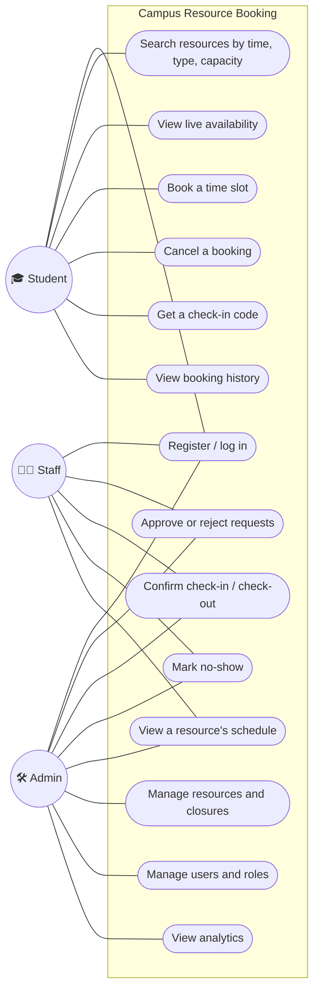
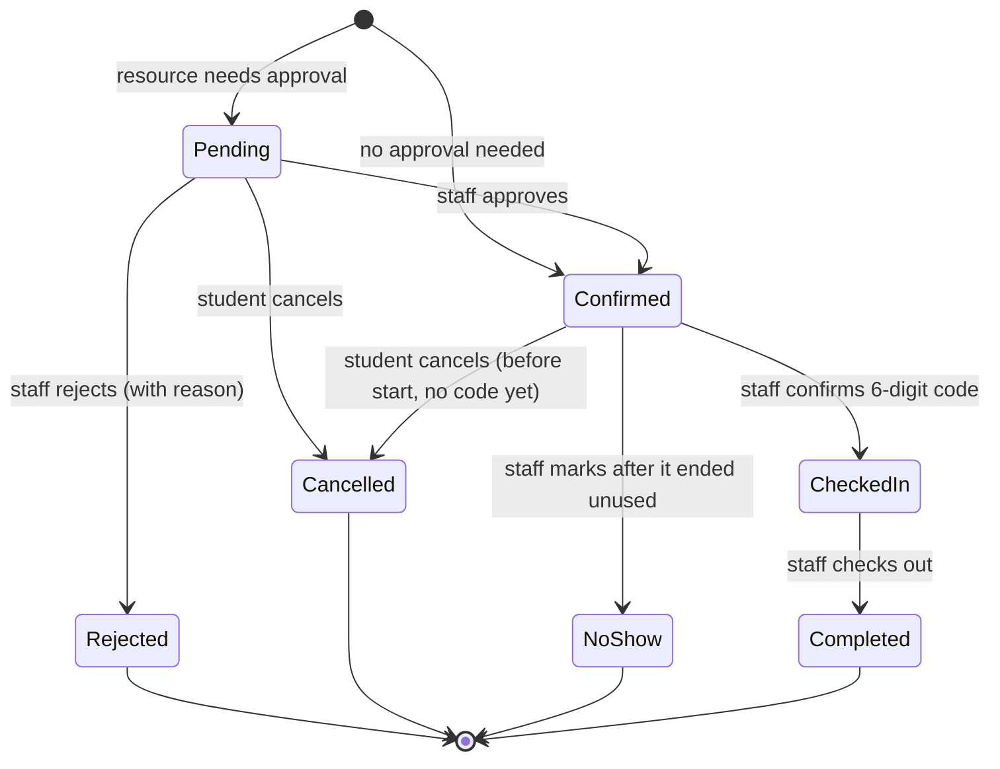
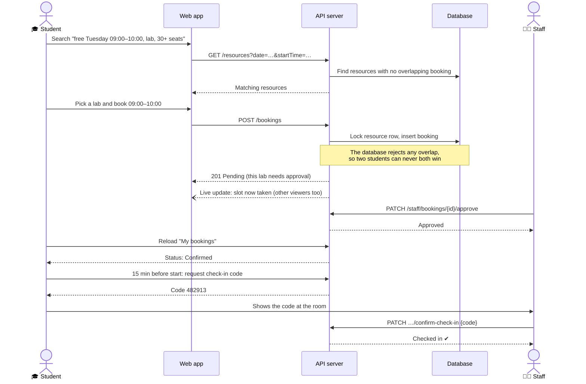

# 1. System overview: roles, use cases, features

**Campus Resource Booking** lets USTH students find and book rooms, laboratories and equipment. Staff approve requests and run check-in. Admins manage the catalog and users, and see how resources are used.

**The problem it solves:** booking by message or on paper causes double bookings, lost requests and no usage data. Here every booking lives in one system, which prevents conflicts and shows availability in real time.

## Three roles

| Role | Who | In one sentence |
| --- | --- | --- |
| 🎓 **Student** | Anyone with an `@usth.edu.vn` email (self-registration) | Finds a free resource, books it, and checks in. |
| 🧑‍💼 **Staff** | Created at first startup, or promoted by an admin | Approves or rejects requests and confirms check-in and check-out. |
| 🛠️ **Admin** | Created at first startup, or promoted | Manages resources, closures and users, and reads the analytics. |

Registration always creates a **student**. Only an admin can promote someone to staff or admin. Admins also have access to everything staff can do.

## Use cases

## Features by role

### 🎓 Student
- **Search**: by keyword, building, type (room, laboratory, equipment), minimum capacity and amenity. Can also show only what is free at a chosen date and time.
- **Availability grid**: the free hourly slots for a day. When someone else books a slot, it **disappears live**.
- **Book** whole hours within opening hours, such as 09:00–11:00. The booking is confirmed at once, or goes to *pending* if the resource needs staff approval.
- **My bookings**: upcoming bookings and history, with cancel (before the start, and before a check-in code is generated) and check-in.
- **Check-in**: from 15 minutes before the start, the student gets a **6-digit code** to show staff.

### 🧑‍💼 Staff
- **Approval queue**: pending requests, oldest first, each approved or rejected with a reason.
- **Operations list**: today's bookings, plus earlier visits still waiting for check-out or a no-show decision.
- **Check-in**: enter the student's 6-digit code. **Check-out** when the student leaves.
- **No-show**: for bookings that ended without a check-in.
- **Resource schedule**: every booking on a resource for a chosen day.

### 🛠️ Admin
- **Resources**: create and edit rooms, labs and equipment, including capacity, amenities, opening hours and days, and whether approval is needed. Set a resource to *active*, *maintenance* or *inactive*.
- **Closures**: close a resource on specific dates, such as holidays or repairs.
- **Users**: search accounts, assign roles, activate or deactivate. A deactivated user is logged out immediately.
- **Analytics** for a date range: total bookings, status breakdown, cancellation rate, most-booked resources, peak hours and utilization rate.

## A booking's life

A pending request that nobody reviews before its time has passed is shown as **"Expired request"**.

*Pending*, *confirmed* and *checked in* bookings **hold the slot**, so nobody else can book an overlapping time. Cancelled and rejected bookings free it again.

## Main flow: from search to check-in

## What makes it more than a CRUD app

| Challenge | How it is solved | Evidence |
| --- | --- | --- |
| **No double booking** | A row lock on the resource, plus a PostgreSQL exclusion constraint that makes overlapping slot-holding bookings impossible | Load test: 100 students booked the same slot at once, 20 times. Each time exactly 1 succeeded and 99 got "409 Conflict". |
| **Fast search** | Database indexes on bookings | Slot search is about 3× less database work and about 1.7× faster for a user ([report](../benchmarks/performance-comparison.md)) |
| **Real-time availability** | WebSocket (Socket.IO) pushes "availability changed" to everyone viewing that resource and day | Open the same grid in two browsers, book in one, and watch the other update |
| **Security** | Session in an `httpOnly` cookie (JavaScript cannot read it), role checks on every route, rate limiting, USTH-only emails | 100 requests per minute per client and route; the 101st gets "429" |
| **Caching** | The building list is cached in memory for 5 minutes | +34% throughput on that route |
