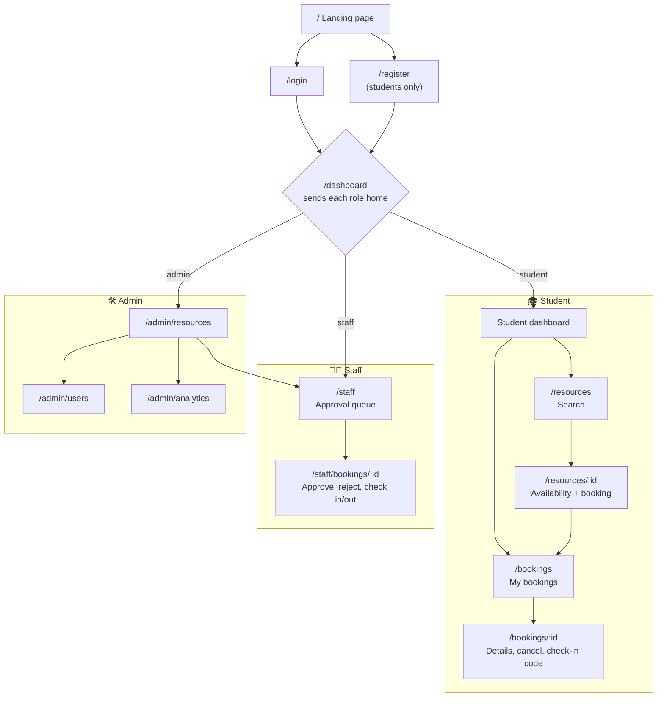

# 3. Screens

13 screens, plus `/welcome`, which only redirects to the dashboard. The wireframes below are simplified; labels in quotes are the real ones in the app. On phones, every two-column layout stacks into one column.

## Screen map



- Anyone who is not logged in and opens a protected page is sent to `/login`, then back to that page after login.
- Opening another role's page redirects to `/dashboard`.
- Staff and admins can also browse `/resources`.
- **Live** screens update without refreshing: the student dashboard and the resource detail page.

---

## Public

### Landing page `/`
```
┌────────────────────────────────────────────────────────────────┐
│ [USTH]  Resources  How it works  For campus teams   [Sign in]  │
├────────────────────────────────────────────────────────────────┤
│ Your next room is already waiting.        ┌──────────────┐     │
│ [Create student account]  [Sign in]       │ availability │     │
│ ✓ Conflict-aware  ✓ Campus access         │ preview card │     │
│ ✓ Approval visibility                     └──────────────┘     │
├────────────────────────────────────────────────────────────────┤
│ [Study rooms]        [Laboratories]        [Equipment]         │
│ From "where?" to reserved: 1 Discover → 2 Reserve → 3 Know     │
│ A useful view for every role: Students · Staff · Admins        │
│ Ready to find your space?   [Create student account]           │
└────────────────────────────────────────────────────────────────┘
```

### Login `/login` and register `/register`
```
┌────────────────────────────┬───────────────────────────────────┐
│ (dark showcase panel)      │ Sign in to your account           │
│                            │ USTH email  [________________]    │
│ Study room A101 · 8 places │ Password    [___________] (show)  │
│ Teaching laboratory L201   │ [    Sign in securely    ]        │
│   Staff approval required  │ New to Campus Resource Booking?   │
│ Portable projector 01      │ Create an account                 │
└────────────────────────────┴───────────────────────────────────┘
Register: Full name · USTH email · Password · Confirm password
          [Create student account]   (@usth.edu.vn only)
```

---

## 🎓 Student

### Dashboard `/dashboard` (live)
```
┌────────────┬───────────────────────────────────────────────────┐
│ Overview   │ Good to see you, An.     [Explore resources]      │
│ Resources  │ Today's availability         3 shown · ⟳ live     │
│ My         │ Room A101  ████▒▒░░████░░                         │
│ bookings   │ Lab L201   ░░████▒▒░░██░░                         │
│            │ Projector  ████████▒▒░░░░                         │
│            │ █ Open  ▒ Partly open  ░ Unavailable              │
│            │ Current or next booking: Lab L201 Tue 09–10       │
│            │ Know what happens next: Find → Track → Check in   │
│ [Sign out] │ What can I book? · Campus booking essentials      │
└────────────┴───────────────────────────────────────────────────┘
Phone: the sidebar becomes a bottom tab bar (Overview · Resources · My bookings)
```

### Search `/resources`
```
┌────────────────────────────────────────────────────────────────┐
│ Dashboard  Resources  My bookings            An · Sign out     │
├────────────────────────────────────────────────────────────────┤
│ Find the right place or equipment.                             │
│ Resource or location [______]  Building [All ▾]                │
│ Resource type [All ▾]  Minimum capacity [__]  Amenity [___]    │
│ Operational date [____]  From [Any ▾]  Until [Any ▾]           │
│ Sort results [Name A–Z ▾]               [Search resources]     │
├────────────────────────────────────────────────────────────────┤
│ ┌ Lab L201 · Active ────────┐ ┌ Room A101 · Active ───────┐    │
│ │ Staff approval required   │ │ No staff approval required│    │
│ │ computers · 40 seats      │ │ projector · 30 seats      │    │
│ │ View resource details →   │ │ View resource details →   │    │
│ └───────────────────────────┘ └───────────────────────────┘    │
│                          ‹ 1 2 3 ›                             │
└────────────────────────────────────────────────────────────────┘
```

### Resource detail and booking `/resources/:id` (live)
```
┌────────────────────────────────────────────────────────────────┐
│ Lab L201 · Main building                 (Active resource)     │
├──────────────────────────────────┬─────────────────────────────┤
│ Check availability               │ Your booking                │
│ Date [2026-09-29] [Check date]   │ Resource  Lab L201          │
│ [07:00] [08:00] [10:00] [11:00]  │ Date      Tue 29 Sep        │
│ [12:00] … (09:00 taken: hidden)  │ Time      10:00–11:00       │
│ ⟳ Availability refreshed.        │ [Send booking request]      │
│                                  │ → "Booking confirmed." or   │
│                                  │   "pending staff approval"  │
├──────────────────────────────────┴─────────────────────────────┤
│ What this resource offers: approval policy · amenities         │
└────────────────────────────────────────────────────────────────┘
```

### My bookings `/bookings` → booking detail `/bookings/:id`
```
┌─ Your campus reservations. ────────────────────────────────────┐
│ Next booking: Lab L201 · Tue 09:00–10:00   [Open booking]      │
│ Confirmed upcoming 2 · Awaiting approval 1 · History 7         │
├──────────────────────────────┬─────────────────────────────────┤
│ Upcoming and pending         │ History                         │
│ Lab L201   (Confirmed)       │ Room A101  (Completed)          │
│ Room B204 (Pending approval) │ Projector  (Cancelled)          │
└──────────────────────────────┴─────────────────────────────────┘

┌─ ← Back to my bookings ────────────────────────────────────────┐
│ Lab L201   Time · Status · Type · Building · Location          │
│ ┌ Show this code to campus staff ┐                             │
│ │          4 8 2 9 1 3           │  Use once ·                 │
│ └────────────────────────────────┘  Do not share               │
│ [Generate check-in code]     [Cancel booking]                  │
│ (opens 15 min before start)  (asks "Release this time slot?")  │
└────────────────────────────────────────────────────────────────┘
```

---

## 🧑‍💼 Staff

### Approval queue `/staff`
```
┌─ Approval queue ───────────────────────────────────────────────┐
│ Booking requests awaiting a decision.          5 Pending       │
│ 5 Requests to review · 3 Open visits to manage                 │
│ 1 Codes ready to verify · 2 Active visits                      │
├────────────────────────────────┬───────────────────────────────┤
│ Arrivals and unresolved visits │ Pending approval queue        │
│ [Code ready for staff]         │ Oldest request first          │
│   Lab L201 09:00 Open visit →  │ 1. Room B204 · Tue 14:00      │
│ [Ready for checkout]           │    Review request →           │
│ [Ready for no-show review]     │ 2. Lab L305 · Wed 08:00       │
└────────────────────────────────┴───────────────────────────────┘
```

### Request detail `/staff/bookings/:id`
```
┌─ ← Back to approval queue ─────────────────────────────────────┐
│ Room B204 · Tue 14:00–15:00                  (Pending review)  │
├──────────────────┬────────────────────────┬────────────────────┤
│ Decision context │ Record your decision   │ Resource schedule  │
│ Requested by     │ [Approve booking]      │ Same resource/date │
│ University email │ [Reject with reason]   │ 13:00  other       │
│ Requested at     │ ── on the day ──       │ 14:00 This request │
│ Type · Building  │ Confirm campus arrival │ 16:00  other       │
│ Location         │ Code [000000]          │                    │
│                  │ [Confirm check-in]     │                    │
│                  │ [Confirm check-out]    │                    │
│                  │ [Mark as no-show]      │                    │
└──────────────────┴────────────────────────┴────────────────────┘
```

---

## 🛠️ Admin

Admin pages share a top bar: **Resources · Users · Analytics · Approvals** (Approvals opens the staff queue).

### Resources `/admin/resources`
```
┌─ Manage bookable resources ────────────────────────────────────┐
│ Total 46 · Active 40 · Maint. 3 · Inactive 3   [Add resource]  │
├────────────────────────────────────────┬───────────────────────┤
│ Resource catalog                       │ Editing resource      │
│ Resource   Bldg  Cap  Rule   Status    │ Code, Type, Name      │
│ Lab L201   LAB    40  Staff  [Active▾] │ Building, Location    │
│ Room A101  MAIN   30  Auto   [Active▾] │ Capacity, Amenities   │
│ …                           [Edit]     │ Days, opening hours   │
│                                        │ [x] Staff approval    │
│                                        │ [Save changes]        │
│                                        │ Scheduled closures    │
│                                        │ [Add closure]         │
└────────────────────────────────────────┴───────────────────────┘
```

### Users `/admin/users`
```
┌─ Put the right access in the right hands ──────────────────────┐
│ Search users [_____]  Role [All ▾]  Access [All ▾]  [Search]   │
├────────────────────────────────────────────────────────────────┤
│ Account                   Role         Joined  Access          │
│ student.demo@usth.edu.vn  [Student ▾]  Sep 20  [Deactivate]    │
│ staff.lab@usth.edu.vn     [Staff ▾]    Sep 01  [Deactivate]    │
│ → every change asks "Confirm access change"                    │
└────────────────────────────────────────────────────────────────┘
```

### Analytics `/admin/analytics`
```
┌─ See where campus time is being reserved ──────────────────────┐
│ From [2026-08-28]  To [2026-09-26]  [Update analytics]         │
│ Total requests 412 · Cancellation 8% · Utilization 23%         │
├──────────────────────────────┬─────────────────────────────────┤
│ Booking status breakdown     │ Peak booking hours              │
│ Confirmed ███████ 60%        │ 08 ██  09 █████  10 ████ …      │
│ Pending   ██ 15%  …          │                                 │
├──────────────────────────────┴─────────────────────────────────┤
│ Most-booked resources: 1. Lab L201  2. Room A101  3. …         │
└────────────────────────────────────────────────────────────────┘
```

The numbers in these wireframes are made-up placeholders, not real data.
